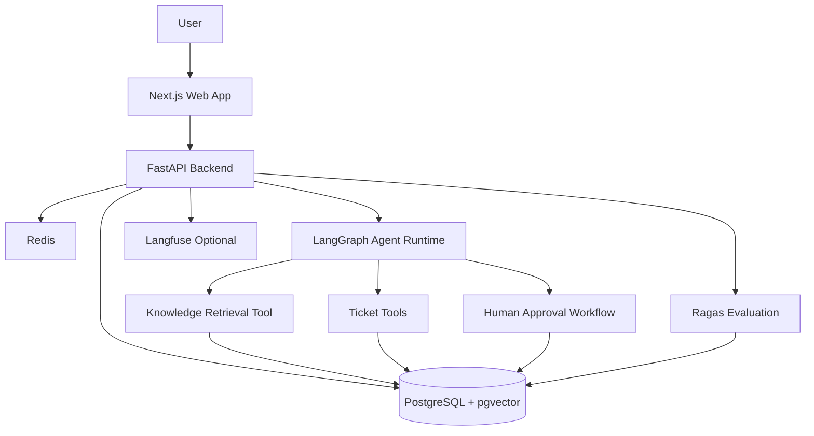

# AgentDesk

[中文文档](README.zh-CN.md)

AgentDesk is an open-source AI support agent platform for production-style customer support and operations workflows.

AgentDesk demonstrates how to build a production-style AI agent system with RAG, tool calling, human-in-the-loop workflows, observability, and evaluation. It is designed as a portfolio-grade reference implementation for teams that want to understand how an AI customer support workspace can move beyond a simple chatbot into a governed operations product.

## Why This Exists

Many AI support demos stop at a single chatbot prompt. AgentDesk is designed as a realistic B2B SaaS reference project that can grow into a portfolio-grade system: knowledge base retrieval, ticket automation, structured agent runs, approval queues, tracing, and evaluations.

## Current Scope

This repository currently implements Phase 1 through Phase 6:

- Monorepo structure
- Next.js web app
- FastAPI backend
- PostgreSQL with pgvector
- Redis
- Docker Compose
- `.env.example`
- `GET /health`
- Landing page
- Dashboard shell
- Sidebar navigation
- Project documentation
- SQLAlchemy database models
- Alembic migration setup
- Initial PostgreSQL schema for users, workspaces, documents, tickets, agent runs, approvals, and evals
- Knowledge base document upload
- PDF, TXT, and Markdown text extraction
- Text chunking with metadata
- Local deterministic embedding placeholder
- pgvector-backed semantic search
- Knowledge base list, upload, search, and chunk preview UI
- Support ticket creation, filtering, detail, messages, status updates, and reply draft placeholder
- LangGraph support agent workflow
- Chat endpoint and dashboard chat UI
- Knowledge-grounded answers with citations
- Structured agent step tracing
- Tool-call preparation for ticket creation
- Agent run, agent step, and tool call persistence
- Human-review flags for risky answers and proposed actions
- Human approval queue API and dashboard UI
- Approve, edit, or reject proposed agent actions
- Approved ticket-creation actions execute and create real support tickets
- Approval decisions update agent run and tool-call state

## Tech Stack

### Frontend

- Next.js
- TypeScript
- Tailwind CSS
- shadcn/ui-style primitives
- React Hook Form
- Zod
- TanStack Query

### Backend

- Python
- FastAPI
- Pydantic
- PostgreSQL
- pgvector
- Redis
- Uvicorn
- LangGraph

Future phases will add agent run explorer pages, Celery or a similar worker queue, Ragas, and optional Langfuse integration.

## Architecture



## Project Structure

```txt
agentdesk/
  README.md
  docker-compose.yml
  .env.example
  Makefile
  infra/
    postgres/
      init.sql
  apps/
    web/
      app/
      components/
      lib/
      package.json
    api/
      app/
      requirements.txt
      pyproject.toml
  docs/
    architecture.md
    product-requirements.md
    api-spec.md
```

## Local Startup

From the repository root:

```bash
cp .env.example .env
docker compose up --build
```

The services will be available at:

- Web app: `http://localhost:3000`
- API: `http://localhost:8000`
- API docs: `http://localhost:8000/docs`
- PostgreSQL: `localhost:5432`
- Redis: `localhost:6379`

You can also use:

```bash
make up
```

## Verify The App

Check the backend:

```bash
curl http://localhost:8000/health
```

Expected response:

```json
{
  "status": "ok",
  "service": "agentdesk-api",
  "environment": "development"
}
```

Check the frontend:

1. Open `http://localhost:3000`
2. Click `Enter Demo Dashboard`
3. Confirm the dashboard shell and sidebar navigation load

## Database Migrations

Phase 2 uses Alembic for schema migrations.

Run migrations from the host after PostgreSQL is up:

```bash
cd apps/api
python -m alembic -c alembic.ini upgrade head
```

Or from the repository root with a local Python environment:

```bash
make migrate
```

The initial migration creates:

- `users`
- `workspaces`
- `documents`
- `document_chunks`
- `tickets`
- `ticket_messages`
- `agent_runs`
- `agent_steps`
- `tool_calls`
- `human_approvals`
- `eval_datasets`
- `eval_cases`
- `eval_runs`
- `eval_results`

It also enables the `vector` extension and stores `document_chunks.embedding` as `vector(1536)`.

## Environment Variables

See `.env.example` for the full template.

Important Phase 1 variables:

- `DATABASE_URL`: PostgreSQL connection string
- `REDIS_URL`: Redis connection string
- `APP_ENV`: runtime environment
- `OPENAI_API_KEY`: reserved for future AI features
- `OPENAI_MODEL`: model label used for agent run tracing
- `OPENAI_EMBEDDING_MODEL`: reserved for future RAG features
- `NEXT_PUBLIC_API_BASE_URL`: browser-visible API base URL

Do not expose real API keys in frontend code.

## Demo Flow

Current demo:

1. Start the stack with Docker Compose.
2. Open the landing page.
3. Enter the dashboard.
4. Open Knowledge Base.
5. Upload a PDF, TXT, or Markdown file.
6. Search the knowledge base.
7. Open a document detail page and inspect chunks.
8. Open Tickets.
9. Create a customer ticket.
10. Add messages, update status or priority, and generate a draft reply.
11. Open Chat and ask a knowledge-base question.
12. Ask for a ticket-creation action and confirm the tool call is marked for human review.
13. Open Approvals.
14. Approve, edit, or reject the pending agent action.
15. Confirm approved ticket-creation actions appear in Tickets.
16. Call `/health` to verify the API is running.

The app creates an `Acme SaaS Support` demo workspace on first use.

## API Overview

Implemented:

- `GET /health`
- `GET /workspaces`
- `GET /workspaces/demo`
- `GET /workspaces/{workspace_id}/documents`
- `POST /workspaces/{workspace_id}/documents/upload`
- `GET /documents/{document_id}`
- `DELETE /documents/{document_id}`
- `GET /documents/{document_id}/chunks`
- `POST /workspaces/{workspace_id}/knowledge/search`
- `GET /workspaces/{workspace_id}/tickets`
- `POST /workspaces/{workspace_id}/tickets`
- `GET /tickets/{ticket_id}`
- `PATCH /tickets/{ticket_id}`
- `POST /tickets/{ticket_id}/messages`
- `POST /tickets/{ticket_id}/draft-reply`
- `POST /workspaces/{workspace_id}/chat`
- `GET /workspaces/{workspace_id}/approvals`
- `GET /approvals/{approval_id}`
- `POST /approvals/{approval_id}/approve`
- `POST /approvals/{approval_id}/reject`

Planned:

- Auth
- Agent run explorer
- Evals
- Settings

## Eval System

The evaluation system is planned for Phase 8. It will support demo eval datasets, eval cases, eval runs, and result storage for faithfulness, answer relevancy, context precision, context recall, and tool call accuracy.

## Roadmap

- Phase 1: Project scaffold, health API, landing page, dashboard shell
- Phase 2: Database models and migrations
- Phase 3: Knowledge base upload, parsing, chunking, embeddings, pgvector search
- Phase 4: Support tickets
- Phase 5: LangGraph agent workflow
- Phase 6: Human approvals
- Phase 7: Agent run tracing
- Phase 8: Evaluation system
- Phase 9: Demo seed data, tests, GitHub Actions, docs, polish

## Screenshots

Screenshots will be added after the dashboard and core product modules are implemented.

## License

MIT
