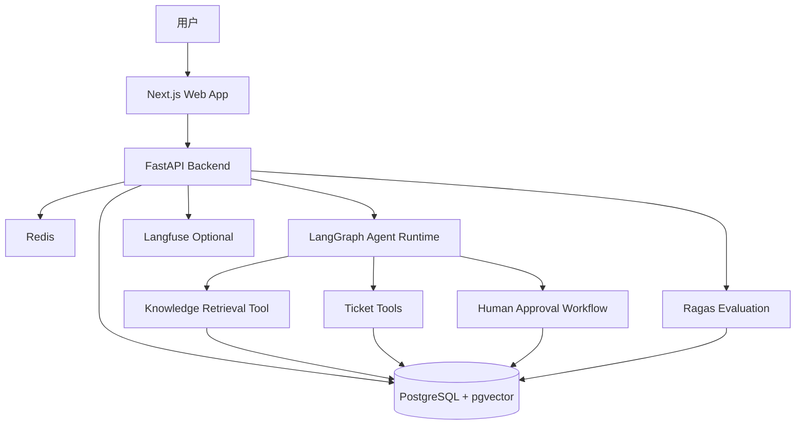

# AgentDesk

[English README](README.md)

AgentDesk 是一个面向真实客服与运营场景的开源 AI 支持代理平台示例项目。它不是一个只会回答问题的聊天框，而是一个更接近生产系统的 B2B SaaS 参考实现：包含知识库检索、工单自动化、Agent 执行轨迹、人类审批、可观测性与评测系统的基础结构。

这个项目适合用作 AI Agent 产品架构、全栈工程能力和 RAG 工作流的作品集项目，也可以作为团队学习如何把 AI 客服从 Demo 推向可治理业务系统的起点。

## 项目亮点

当前仓库已经实现 Phase 1 到 Phase 6：

- Monorepo 项目结构
- Next.js 前端应用
- FastAPI 后端服务
- PostgreSQL + pgvector
- Redis
- Docker Compose 本地开发环境
- 健康检查接口 `GET /health`
- Landing page
- Dashboard 工作台框架
- 侧边栏导航
- SQLAlchemy 数据模型
- Alembic 数据库迁移
- 用户、工作区、文档、工单、Agent Run、审批、评测等核心表结构
- 知识库文档上传
- PDF、TXT、Markdown 文本解析
- 文本分块和元数据存储
- 本地确定性 embedding 占位实现
- 基于 pgvector 的语义搜索
- 知识库列表、上传、搜索和 chunk 预览 UI
- 工单创建、筛选、详情、消息、状态更新和回复草稿
- LangGraph 支持代理工作流
- Chat API 和聊天工作台 UI
- 带 citation 的知识库问答
- 结构化 Agent Step 追踪
- 工单创建工具调用准备
- Agent Run、Agent Step、Tool Call 持久化
- 高风险回答和拟执行动作的人类复核标记
- Human Approval 队列 API 与前端页面
- 审批、编辑或拒绝 Agent 拟执行动作
- 审批通过后的工单创建动作会真实创建支持工单
- 审批结果会更新 Agent Run 和 Tool Call 状态

## 技术栈

### 前端

- Next.js
- TypeScript
- Tailwind CSS
- shadcn/ui 风格基础组件
- React Hook Form
- Zod
- TanStack Query

### 后端

- Python
- FastAPI
- Pydantic
- PostgreSQL
- pgvector
- Redis
- Uvicorn
- LangGraph

后续阶段计划加入 Agent Run Explorer、后台任务队列、Ragas 评测，以及可选的 Langfuse 集成。

## 架构概览



## 项目结构

```txt
agentdesk/
  README.md
  README.zh-CN.md
  docker-compose.yml
  .env.example
  Makefile
  infra/
    postgres/
      init.sql
  apps/
    web/
      app/
      components/
      lib/
      package.json
    api/
      app/
      requirements.txt
      pyproject.toml
  docs/
    architecture.md
    product-requirements.md
    api-spec.md
```

## 本地启动

在仓库根目录运行：

```bash
cp .env.example .env
docker compose up --build
```

服务地址：

- Web 应用：`http://localhost:3000`
- API：`http://localhost:8000`
- API 文档：`http://localhost:8000/docs`
- PostgreSQL：`localhost:5432`
- Redis：`localhost:6379`

也可以运行：

```bash
make up
```

## 验证应用

检查后端：

```bash
curl http://localhost:8000/health
```

预期返回：

```json
{
  "status": "ok",
  "service": "agentdesk-api",
  "environment": "development"
}
```

检查前端：

1. 打开 `http://localhost:3000`
2. 点击 `Enter Demo Dashboard`
3. 确认 Dashboard 和侧边栏正常加载

## 数据库迁移

Phase 2 使用 Alembic 管理数据库迁移。

PostgreSQL 启动后，可以在主机上运行：

```bash
cd apps/api
python -m alembic -c alembic.ini upgrade head
```

也可以在仓库根目录运行：

```bash
make migrate
```

初始迁移会创建：

- `users`
- `workspaces`
- `documents`
- `document_chunks`
- `tickets`
- `ticket_messages`
- `agent_runs`
- `agent_steps`
- `tool_calls`
- `human_approvals`
- `eval_datasets`
- `eval_cases`
- `eval_runs`
- `eval_results`

同时启用 `vector` 扩展，并将 `document_chunks.embedding` 存储为 `vector(1536)`。

## 环境变量

完整模板见 `.env.example`。

重要变量：

- `DATABASE_URL`：PostgreSQL 连接字符串
- `REDIS_URL`：Redis 连接字符串
- `APP_ENV`：运行环境
- `OPENAI_API_KEY`：为后续 AI 功能预留
- `OPENAI_MODEL`：用于 Agent Run 追踪的模型标签
- `OPENAI_EMBEDDING_MODEL`：为后续 RAG embedding 预留
- `NEXT_PUBLIC_API_BASE_URL`：浏览器可见的 API 地址

不要把真实 API Key 暴露在前端代码中。

## 演示流程

当前演示流程：

1. 使用 Docker Compose 启动服务。
2. 打开 Landing page。
3. 进入 Dashboard。
4. 打开 Knowledge Base。
5. 上传 PDF、TXT 或 Markdown 文件。
6. 搜索知识库。
7. 打开文档详情页并查看 chunks。
8. 打开 Tickets。
9. 创建客户工单。
10. 添加消息，更新状态或优先级，生成回复草稿。
11. 打开 Chat，询问知识库问题。
12. 请求 Agent 创建工单，并确认工具调用进入 human review。
13. 打开 Approvals。
14. 审批、编辑或拒绝待处理动作。
15. 确认审批通过的工单创建动作出现在 Tickets 中。
16. 调用 `/health` 确认 API 正常运行。

应用首次使用时会自动创建 `Acme SaaS Support` 演示工作区。

## API 概览

已实现：

- `GET /health`
- `GET /workspaces`
- `GET /workspaces/demo`
- `GET /workspaces/{workspace_id}/documents`
- `POST /workspaces/{workspace_id}/documents/upload`
- `GET /documents/{document_id}`
- `DELETE /documents/{document_id}`
- `GET /documents/{document_id}/chunks`
- `POST /workspaces/{workspace_id}/knowledge/search`
- `GET /workspaces/{workspace_id}/tickets`
- `POST /workspaces/{workspace_id}/tickets`
- `GET /tickets/{ticket_id}`
- `PATCH /tickets/{ticket_id}`
- `POST /tickets/{ticket_id}/messages`
- `POST /tickets/{ticket_id}/draft-reply`
- `POST /workspaces/{workspace_id}/chat`
- `GET /workspaces/{workspace_id}/approvals`
- `GET /approvals/{approval_id}`
- `POST /approvals/{approval_id}/approve`
- `POST /approvals/{approval_id}/reject`

计划中：

- Auth
- Agent Run Explorer
- Evals
- Settings

## 评测系统

评测系统计划在 Phase 8 实现。目标是支持 demo eval datasets、eval cases、eval runs，并存储 faithfulness、answer relevancy、context precision、context recall、tool call accuracy 等评测结果。

## 路线图

- Phase 1：项目脚手架、健康检查 API、Landing page、Dashboard shell
- Phase 2：数据库模型和迁移
- Phase 3：知识库上传、解析、分块、embedding、pgvector 搜索
- Phase 4：支持工单系统
- Phase 5：LangGraph Agent 工作流
- Phase 6：Human approvals
- Phase 7：Agent Run tracing / explorer
- Phase 8：Evaluation system
- Phase 9：Demo seed data、测试、GitHub Actions、文档和 polish

## License

MIT
