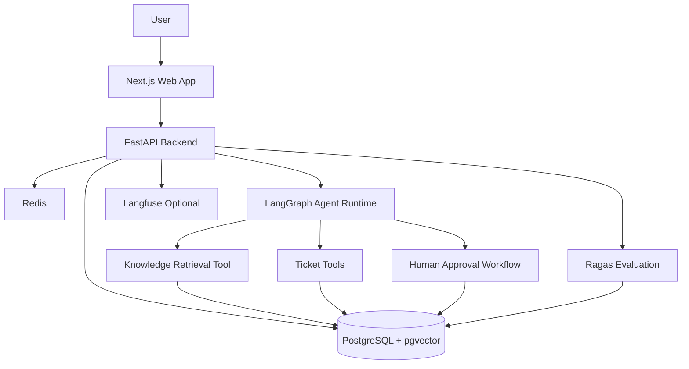

# AgentDesk Architecture

```mermaid
flowchart TD
    U[User] --> W[Next.js Web App]
    W --> API[FastAPI Backend]
    API --> DB[(PostgreSQL + pgvector)]
    API --> R[Redis]
    API --> LG[LangGraph Agent Runtime]
    LG --> RET[Knowledge Retrieval Tool]
    LG --> TKT[Ticket Tools]
    LG --> APR[Human Approval Workflow]
    RET --> DB
    TKT --> DB
    APR --> DB
    API --> OBS[Langfuse Optional]
    API --> EVAL[Ragas Evaluation]
    EVAL --> DB
```

Phase 1 wires the web app, API, PostgreSQL with pgvector, and Redis. Agent runtime, retrieval, approvals, tracing, and evaluation are planned for later phases.

